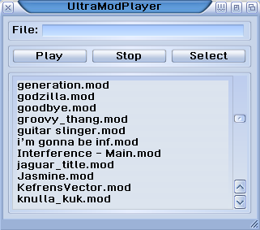

# UltraModPlayer 0.21 beta
Amiga Modules Player for MorphOS (based on UADE) 

## TODO

* playlist
* displaing module name and type
* decoding and play modules compressed with XPK

## Compilation

* Clone or download UltraModPlayer
* Open MorphOS console, and go to the `UADE/src` drawer.
* Type `configure` command
* Type `make` command
* If everything goes well, the compiled `uade` file should be placed in the `UADE` drawer

## Usage

* Open compiled `UADE` file, 
* Type the name of the module inside the text field `File` (module file should be placed in the same drawer as `UADE`)
* Press PLAY
* Enjoy the beautiful sounds of Amiga Music Modules :)
